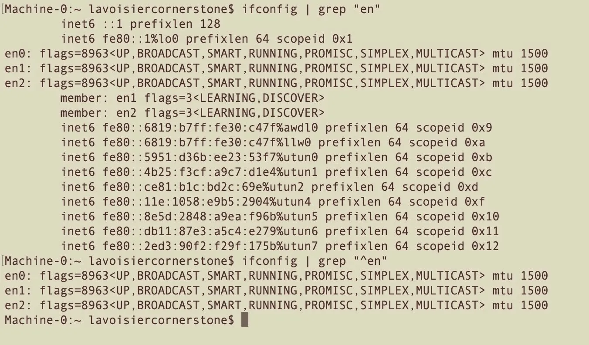
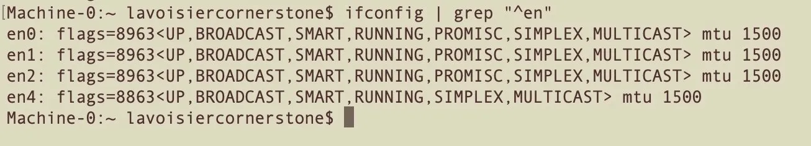
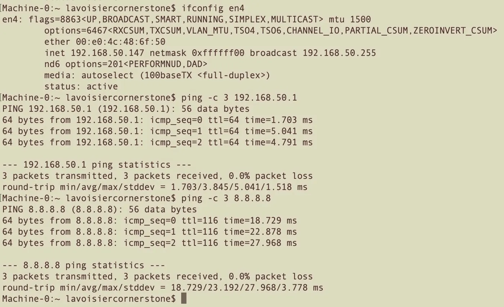
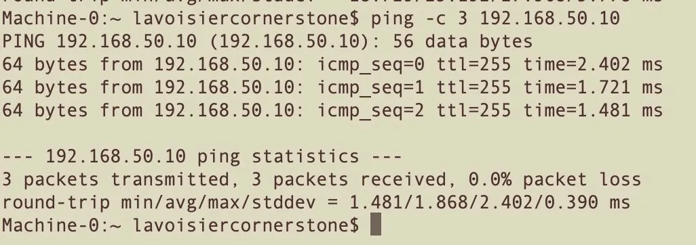
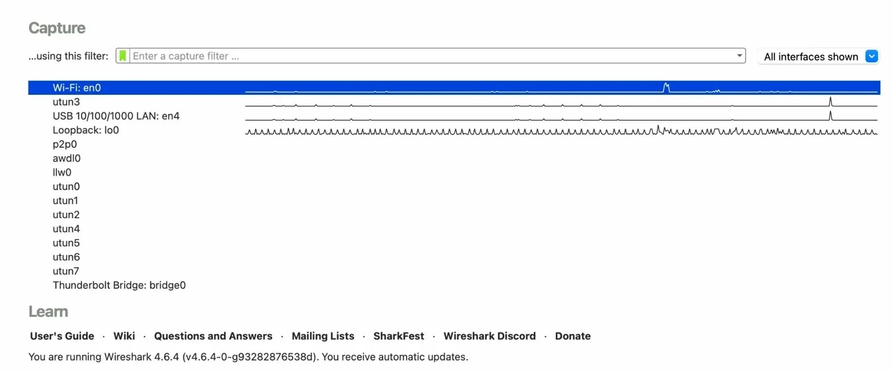
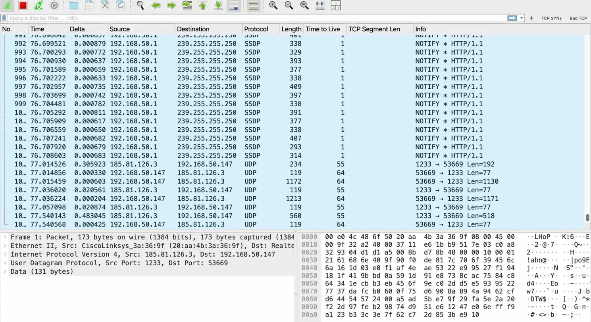
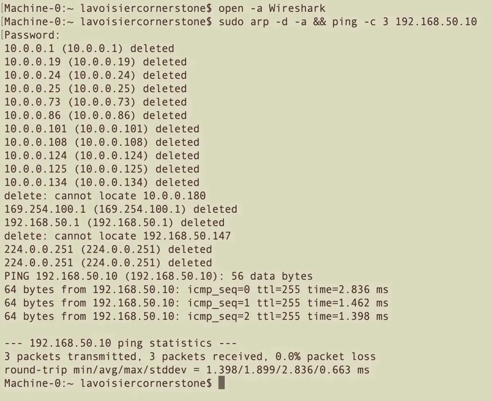
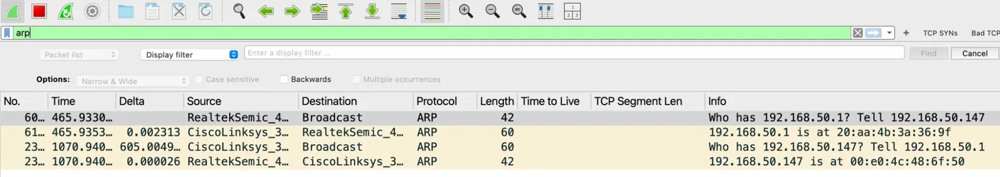
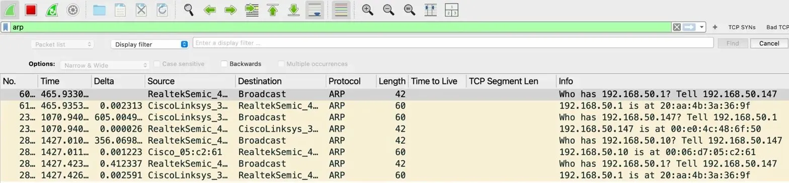

# ARP Analysis: Live Capture on Physical Cisco Hardware

**Lab:** 01 — Address Resolution Protocol
**Equipment:** MacBook Pro 2015 (macOS Monterey 12.7.6) · Cisco 2600 Router · Linksys E2500 Buffer Router · Insignia USB-A to Gigabit Ethernet Adapter
**Tool:** Wireshark 4.6.4
**Capture Interface:** en4 (USB 10/100/1000 LAN)
**Capture File:** `lab01-arp-cisco2600.pcapng`
**CCNA Domain:** 1.0 Network Fundamentals — IP to MAC resolution, broadcast domains

---

## Overview

ARP (Address Resolution Protocol) is the bridge between Layer 3 (IP) and Layer 2 (MAC). Every IP communication on a LAN begins with ARP. Before any packet can be delivered on an Ethernet network, the sender must know the destination's MAC address. If it doesn't, it broadcasts an ARP request to the entire subnet and waits for a reply.

This lab captures a complete ARP exchange on a physical Cisco lab network — from cache flush to verified entry — using Wireshark on a MacBook connected via USB Ethernet adapter to a Linksys buffer router on the same subnet as a Cisco 2600 router.

---

## Lab Environment

| Component | Device | IP Address |
|---|---|---|
| Capture Station | MacBook Pro 2015 — macOS Monterey 12.7.6 | 192.168.50.147 |
| Capture Interface | Insignia USB-A Gigabit Ethernet (en4) | 192.168.50.147 |
| Buffer Router | Linksys E2500 | 192.168.50.1 |
| Lab Gateway | Cisco 2600 Router (IOS 12.1(3)T) | 192.168.50.10 |

### Network Path

```
MacBook (en4) → Linksys E2500 (192.168.50.1) → Cisco 2600 (192.168.50.10)
```

---

## Interface Setup

Before starting the capture, the USB Ethernet adapter was identified using two `ifconfig` grep commands — one broad, one precise:

```bash
ifconfig | grep "en"    # all lines containing "en" — noisy output
ifconfig | grep "^en"   # only interface name lines — clean
```



The `^` in `grep "^en"` means "starts with" — it strips the noise from inet6, prefixlen, and bridge member lines that all contain the letters "en" but aren't interface names. The second command is the useful one.



en4 appeared after plugging in the Insignia adapter. No driver installation required on macOS Monterey.

### Connectivity Verification

With en4 confirmed, full path connectivity was verified — adapter to Linksys to internet, then directly to the Cisco 2600:

```bash
ifconfig en4             # confirm DHCP assignment from Linksys
ping -c 3 192.168.50.1  # Linksys reachable
ping -c 3 8.8.8.8       # internet reachable through the full lab chain
```



```bash
ping -c 3 192.168.50.10  # Cisco 2600 reachable
```



> **TTL Fingerprinting:** The TTL value in a ping reply reveals the responding device's OS/firmware without any login. Cisco IOS returns TTL 255. Linux-based devices — including most consumer routers like the Linksys — return TTL 64. This is passive device fingerprinting from a single ping.

---

## Lab Procedure

### Step 1 — Start Wireshark on en4

```bash
open -a Wireshark
```

Selected **USB 10/100/1000 LAN: en4** from the capture interface list. The traffic activity waveform next to en4 confirms the adapter is live and already seeing packets before capture starts.



Started capture. Before applying any filter, the raw capture showed what a real network segment looks like:

- **SSDP flood** from `192.168.50.1` (Linksys) blasting `NOTIFY * HTTP/1.1` to `239.255.255.250` — Simple Service Discovery Protocol, UPnP multicast noise from consumer router firmware running constantly in the background
- **UDP streaming traffic** between MacBook (`192.168.50.147`) and external host `185.81.126.3` on port 1233



The ARP traffic is in there — buried under everything else. Applied display filter:

```
arp
```

### Step 2 — Flush ARP Cache and Force Fresh Exchange

```bash
sudo arp -d -a && ping -c 3 192.168.50.10
```

**Command breakdown:**

| Part | Meaning |
|---|---|
| `sudo` | Run as root — required to delete ARP cache entries |
| `arp` | ARP utility — view and manipulate the ARP cache |
| `-d` | Delete — remove entries rather than display them |
| `-a` | All — apply to every entry in the cache |
| `&&` | Conditional chain — only run ping if arp flush succeeded |
| `ping -c 3` | Send exactly 3 ICMP echo requests then stop |
| `192.168.50.10` | Target — Cisco 2600 router |



The flush output shows every cached entry being deleted — `10.0.0.x` addresses from the upstream home network, the Linksys at `192.168.50.1`, multicast group addresses. The `delete: cannot locate 192.168.50.147` line is expected — a host doesn't cache its own IP in the ARP table. The ping fires immediately after: `ttl=255` on every reply confirms Cisco IOS.

With the cache empty, the MacBook had no record of the Cisco 2600's MAC address. Before the first ICMP packet could leave, an ARP request had to go out first.

---

## Capture Analysis

### ARP Exchange — Linksys First

With the `arp` filter applied, the first packets visible were the MacBook-to-Linksys ARP exchange — triggered by the ping attempting to reach the gateway before going to the Cisco 2600:



Four packets: MacBook asking for `192.168.50.1`, Linksys replying, then Linksys asking for `192.168.50.147`, MacBook replying. Each side caches the other's MAC after the first exchange. Normal bidirectional ARP.

### ARP Exchange — Full Picture Including Cisco 2600

After the cache flush and ping completed, the Cisco 2600 ARP exchange appeared alongside the earlier Linksys packets:



| Packet | Source | Destination | Info |
|---|---|---|---|
| 60 | RealtekSemic (MacBook en4) | Broadcast | Who has 192.168.50.1? Tell 192.168.50.147 |
| 61 | CiscoLinksys (Linksys) | RealtekSemic (MacBook) | 192.168.50.1 is at 20:aa:4b:3a:36:9f |
| 23x | CiscoLinksys (Linksys) | Broadcast | Who has 192.168.50.147? Tell 192.168.50.1 |
| 23x | RealtekSemic (MacBook) | CiscoLinksys (Linksys) | 192.168.50.147 is at 00:e0:4c:48:6f:50 |
| 28x | RealtekSemic (MacBook) | Broadcast | Who has 192.168.50.10? Tell 192.168.50.147 |
| 28x | Cisco_05:c2:61 | RealtekSemic (MacBook) | 192.168.50.10 is at 00:06:d7:05:c2:61 |

> **MAC Prefix Resolution:** Wireshark automatically resolves MAC OUI prefixes to manufacturer names. `RealtekSemic` = Insignia USB adapter (Realtek chipset). `CiscoLinksys` = Linksys E2500. `Cisco_05:c2:61` = Cisco 2600 router. The first 3 bytes of any MAC address identify the manufacturer — passive device identification with zero interaction.

---

### ARP Request — Field-by-Field (MacBook → Cisco 2600)

**Ethernet II Layer:**

| Field | Value | Meaning |
|---|---|---|
| Source | 00:e0:4c:48:6f:50 (RealtekSemic) | MacBook's en4 adapter |
| Destination | ff:ff:ff:ff:ff:ff | Broadcast — sent to every device on the subnet |
| EtherType | 0x0806 | Payload is ARP |

**Address Resolution Protocol Layer:**

| Field | Value | Meaning |
|---|---|---|
| Hardware type | Ethernet (1) | Resolving a MAC on Ethernet |
| Protocol type | IPv4 (0x0800) | Looking for the MAC behind an IPv4 address |
| Hardware size | 6 | MAC addresses are 6 bytes |
| Protocol size | 4 | IPv4 addresses are 4 bytes |
| Opcode | request (1) | This is a question — 1=request, 2=reply |
| Sender MAC | 00:e0:4c:48:6f:50 | I am this MAC |
| Sender IP | 192.168.50.147 | I am this IP |
| Target MAC | 00:00:00:00:00:00 | Unknown — this is what I'm asking for |
| Target IP | 192.168.50.10 | I need the MAC for this IP |

---

### ARP Reply — Field-by-Field (Cisco 2600 → MacBook)

**Ethernet II Layer:**

| Field | Value | Meaning |
|---|---|---|
| Source | 00:06:d7:05:c2:61 (Cisco_05:c2:61) | Cisco 2600 router |
| Destination | 00:e0:4c:48:6f:50 (RealtekSemic) | Unicast directly to MacBook — not broadcast |
| EtherType | 0x0806 | Still ARP |
| Padding | 000000...00 | Zero-padding to meet Ethernet minimum frame size of 64 bytes |

**Address Resolution Protocol Layer:**

| Field | Value | Meaning |
|---|---|---|
| Opcode | reply (2) | This is an answer |
| Sender MAC | 00:06:d7:05:c2:61 | I am this MAC |
| Sender IP | 192.168.50.10 | I am this IP |
| Target MAC | 00:e0:4c:48:6f:50 | Your MAC (now fully populated) |
| Target IP | 192.168.50.147 | Your IP |

**Key difference from the request:** Destination changed from broadcast (`ff:ff:ff:ff:ff:ff`) to unicast (`00:e0:4c:48:6f:50`). The Cisco 2600 knew exactly who to answer — the requester identified themselves in the request. The reply never needs to broadcast.

---

## ARP Cache Verification

After the exchange, the learned MAC was verified in the macOS ARP table:

```bash
ping -c 1 192.168.50.10 && arp -a | grep 192.168.50.10
```

```
? (192.168.50.10) at 0:6:d7:5:c2:61 on en4 ifscope [ethernet]
```

MAC `00:06:d7:05:c2:61` matches exactly what Wireshark captured in the ARP reply. macOS drops leading zeros for display brevity — same address.

---

## Key Takeaways

| Concept | What the Capture Proved |
|---|---|
| ARP request is always broadcast | Destination MAC = ff:ff:ff:ff:ff:ff every time |
| ARP reply is always unicast | Cisco 2600 replied directly to MacBook — not broadcast |
| Opcode distinguishes request from reply | 1 = request, 2 = reply — single field change |
| Target MAC is zeroed in requests | 00:00:00:00:00:00 = "I don't know yet" |
| Ethernet minimum frame size is 64 bytes | Cisco padded the reply with zeros |
| ARP cache entries expire | Entry for 192.168.50.10 expired between pings — had to re-trigger |
| TTL fingerprints devices | Cisco IOS = 255, Linux/consumer routers = 64 |
| MAC OUI identifies manufacturers | First 3 bytes of MAC reveal the vendor — no login required |
| Raw captures are noisy | SSDP, UDP streaming, multicast all present before filtering |

---

## Real-World Relevance

**ARP poisoning / spoofing** — an attacker sends gratuitous ARP replies to poison the cache of other hosts, redirecting traffic through their machine. Understanding the normal ARP exchange is the baseline for detecting abnormal ARP behavior.

**Broadcast domain boundaries** — ARP cannot cross a router. VLANs create separate broadcast domains, meaning ARP is contained within each VLAN. This is why inter-VLAN routing requires a Layer 3 device.

**Proxy ARP** — a router can respond to ARP requests on behalf of hosts in other subnets, making them appear locally reachable. Configurable on Cisco IOS with `ip proxy-arp`.

---

## Files

| File | Description |
|---|---|
| `lab01-arp-cisco2600.pcapng` | Full Wireshark capture — ARP exchange with Cisco 2600 |
| `ifconfig-grep-en-interfaces.png` | Interface discovery — broad grep output |
| `ifconfig-grep-caret-en-interfaces.png` | Interface discovery — clean grep showing en4 |
| `en4-ifconfig-ping-gateway-internet.png` | en4 config, ping to Linksys and 8.8.8.8 |
| `ping-cisco-2600-success.png` | Ping to Cisco 2600 — ttl=255 confirmed |
| `wireshark-interface-selection-en4.png` | Wireshark interface list — en4 selected |
| `wireshark-initial-capture-ssdp-udp.png` | Raw capture before filtering — SSDP + UDP noise |
| `wireshark-arp-filter-linksys-exchange.png` | ARP filter — Linksys exchange |
| `terminal-arp-flush-ping-cisco.png` | ARP cache flush output + ping |
| `wireshark-arp-filter-full-exchange.png` | ARP filter — complete exchange with Cisco 2600 |

---

*Lavoisier Cornerstone — [lavoisier.dev](https://lavoisier.dev) | [github.com/cornerstonian](https://github.com/cornerstonian)*
*Part of the [wireshark-traffic-analysis-ccna](https://github.com/cornerstonian/wireshark-traffic-analysis-ccna) project series*
