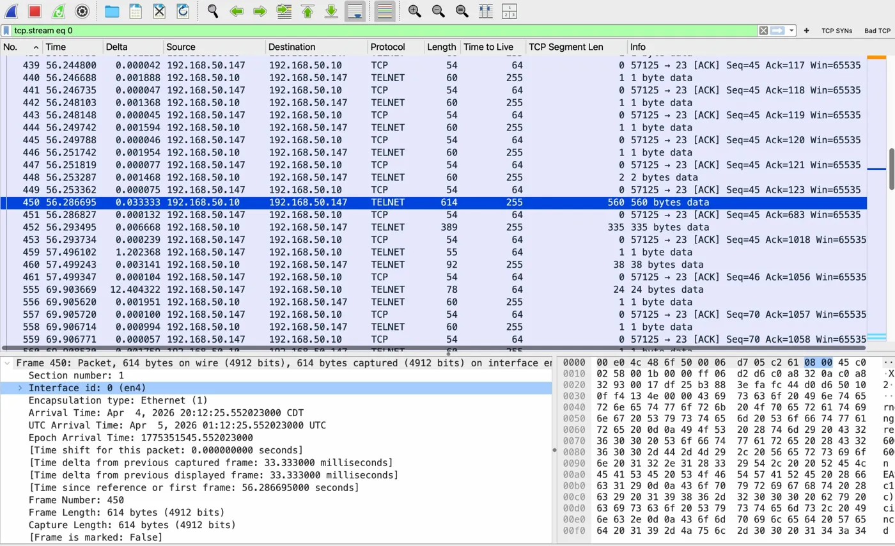
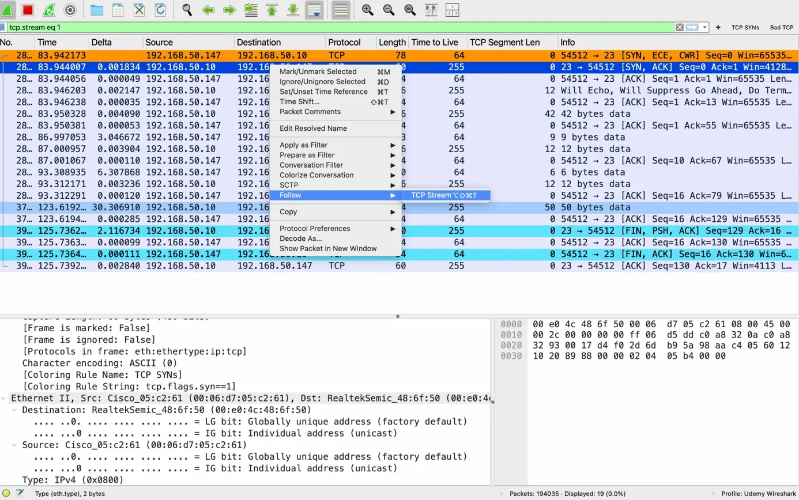
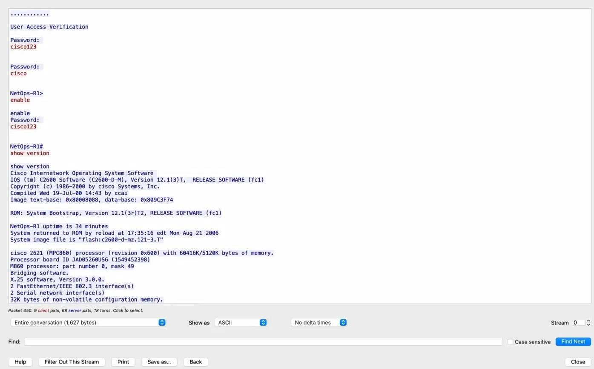
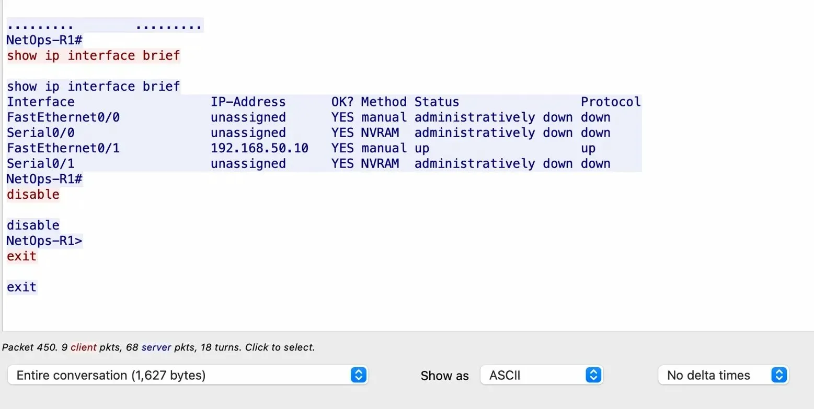

# TCP Streams & Cleartext Credential Exposure
**Lab: 03 — Expert Info, TCP Streams, and Protocol Analysis**
**Equipment:** MacBook Pro 2015 (macOS Monterey 12.7.6) · Cisco 2621 Router (NetOps-R1) · Linksys E2500 Buffer Router · Insignia USB-A to Gigabit Ethernet Adapter
**Tool:** Wireshark 4.6.4 · netcat (nc)
**Capture Interface:** en4 (USB 10/100/1000 LAN)
**Capture File:** lab03-telnet-tcp-stream.pcapng (stored locally)
**CCNA Domain:** 1.0 Network Fundamentals — TCP operation, remote access protocols, network security fundamentals

---

## Overview

Telnet is a plaintext protocol. Every byte transmitted — including usernames, passwords, and command output — travels across the network in cleartext with zero encryption. This lab proves it.

Using Wireshark's TCP Stream reassembly feature, a full Telnet session to a Cisco 2621 router is reconstructed from raw packets. The result is a human-readable transcript of the entire session: authentication prompts, credentials typed, commands issued, and router responses — all visible to anyone on the same network segment.

This lab also documents a real-world router recovery scenario involving ROMMON password recovery, configuration register manipulation, and interface misconfiguration diagnosis — skills directly tested on the CCNA 200-301 exam.

---

## Lab Environment

| Component | Device | IP Address |
|---|---|---|
| Capture Station | MacBook Pro 2015 — macOS Monterey 12.7.6 | 192.168.50.147 |
| Capture Interface | Insignia USB-A Gigabit Ethernet (en4) | 192.168.50.147 |
| Buffer Router | Linksys E2500 | 192.168.50.1 |
| Lab Gateway | Cisco 2621 Router (NetOps-R1) | 192.168.50.10 |

**Active interface on NetOps-R1:** FastEthernet0/1 → Linksys E2500 LAN port
**IOS Version:** C2600-D-M, Version 12.1(3)T (base image — no crypto support)

---

## Pre-Lab: Router Recovery

Before the Telnet capture could begin, the router required password recovery. An unknown `enable secret` hash in the original startup-config blocked privileged exec access. This is documented here because it reflects real-world recovery procedure and is directly relevant to CCNA exam objectives.

### ROMMON Password Recovery — confreg 0x2142

The Cisco password recovery procedure bypasses NVRAM on boot using the configuration register.

**Step 1 — Send break signal during boot**

In `screen` on macOS:
```
Ctrl+A then \
```
Sent within the first 60 seconds of boot. Drops into ROMMON.

**Step 2 — Set config register to ignore NVRAM**
```
rommon 1 > confreg 0x2142
rommon 2 > reset
```

**Step 3 — Boot to blank config**

At the System Configuration Dialog:
```
Would you like to enter initial config dialog? [yes/no]: no
Press RETURN to get started.
Router>enable
Router#
```

No password required — running config is empty.

**Step 4 — Erase startup-config to eliminate unknown secret**

Critical difference from standard recovery: instead of copying startup-config to running-config (which would reload the unknown secret hash), the startup-config was erased entirely.
```
Router#erase startup-config
```

**Step 5 — Build clean config from scratch**
```
Router#conf t
Router(config)#hostname NetOps-R1
NetOps-R1(config)#enable password cisco123
NetOps-R1(config)#line vty 0 4
NetOps-R1(config-line)#password cisco
NetOps-R1(config-line)#login
NetOps-R1(config-line)#transport input telnet
NetOps-R1(config-line)#exit
NetOps-R1(config)#interface fastethernet0/1
NetOps-R1(config-if)#ip address 192.168.50.10 255.255.255.0
NetOps-R1(config-if)#no shutdown
NetOps-R1(config-if)#exit
NetOps-R1(config)#config-register 0x2102
NetOps-R1(config)#exit
NetOps-R1#write memory
NetOps-R1#reload
```

### Interface Misconfiguration Discovery

After recovery, `ping 192.168.50.10` from the MacBook failed with `No route to host`. The IP had been assigned to FastEthernet0/0 — but the physical cable connecting the router to the Linksys was plugged into FastEthernet0/1.

Diagnosis via `show ip interface brief`:

```
Interface         IP-Address      OK? Method Status    Protocol
FastEthernet0/0   192.168.50.10   YES NVRAM  up        down
FastEthernet0/1   unassigned      YES NVRAM  admin down down
```

`up / down` on Fa0/0 = interface not shutdown, but no physical link detected. Cable was on Fa0/1.

Fix — remove IP from Fa0/0, assign to Fa0/1:
```
NetOps-R1(config)#interface fastethernet0/0
NetOps-R1(config-if)#no ip address
NetOps-R1(config-if)#shutdown
NetOps-R1(config-if)#exit
NetOps-R1(config)#interface fastethernet0/1
NetOps-R1(config-if)#ip address 192.168.50.10 255.255.255.0
NetOps-R1(config-if)#no shutdown
```

Result:
```
FastEthernet0/1   192.168.50.10   YES manual up        up
```

Ping confirmed: 6 packets transmitted, 0% packet loss.

---

## Wireshark Capture Setup

- Interface: `en4`
- Display filter: `tcp.port == 23`
- Capture started before initiating Telnet session

---

## Telnet Session

Initiated from MacBook terminal:
```bash
nc -v 192.168.50.10 23
```

Output:
```
Connection to 192.168.50.10 port 23 [tcp/telnet] succeeded!
```

Session walk-through:
```
Password: cisco          ← VTY line password
NetOps-R1>enable
Password: cisco123       ← Enable password
NetOps-R1#show version
NetOps-R1#show ip interface brief
NetOps-R1#disable
NetOps-R1>exit
```

---

## Wireshark Analysis

### Packet Capture View



The packet list shows the full TCP conversation between `192.168.50.147` (MacBook) and `192.168.50.10` (NetOps-R1) on port 23. Wireshark correctly identifies packets as TELNET protocol. The alternating TCP ACK pattern — one TELNET data packet followed immediately by a TCP ACK — is characteristic of Telnet's interactive, character-by-character transmission.

Key observations from the packet list:
- TELNET packets originating from `192.168.50.10` (server → client) carry the router's responses
- TCP ACKs from `192.168.50.147` confirm receipt of each segment
- Packet 450: 560 bytes — the `show version` response delivered in a single large segment
- Frame detail confirms capture on `en4` with correct source MAC `Cisco_05:c2:61`

### Following the TCP Stream — Process



Right-click any TELNET packet → **Follow → TCP Stream**

Wireshark reassembles all TCP segments belonging to that conversation into a single human-readable view. Client-sent data (typed by the user) appears in red. Server-sent data (router responses) appears in blue.

The TCP SYN packet is highlighted in orange — Wireshark's coloring rule for `tcp.flags.syn==1`. The three-way handshake is visible: SYN → SYN-ACK → ACK before any data is exchanged. The FIN-PSH-ACK packets at the bottom confirm clean session teardown.

### TCP Stream — Cleartext Credentials



The TCP Stream window reconstructs the full session. Every credential typed is visible in plaintext:

| Field | Value Captured |
|---|---|
| VTY Password | `cisco` |
| Enable Password | `cisco123` |
| Privilege Level | Escalated to enable (NetOps-R1#) |

Both passwords appear in red — meaning they were captured exactly as typed by the client, character by character, and transmitted without any encryption across the network.

The router's `show version` response is fully readable: IOS version, hardware model, uptime, flash image filename, memory allocation — all returned in cleartext.

### TCP Stream — Commands and Clean Exit



The second half of the TCP stream shows the complete command output:

- `show ip interface brief` — full interface table with IP assignments and status
- `disable` — privilege level drop from enable back to user exec
- `exit` — clean session termination

An attacker capturing this stream has: valid credentials for both VTY and enable access, the router's IOS version and hardware model for vulnerability research, the full interface table revealing network topology, and confirmation that the session terminated cleanly.

**Total conversation: 1,627 bytes. 9 client packets. 68 server packets. 18 turns.**

---

## Key Findings

| Finding | Detail |
|---|---|
| Telnet transmits credentials in plaintext | `cisco` and `cisco123` fully visible in TCP stream |
| Command output is unencrypted | `show version` and `show ip interface brief` readable by any observer |
| TCP Stream reassembly is trivial | Right-click → Follow → TCP Stream — no decryption required |
| Character-by-character transmission | Each keystroke sent as a separate TCP segment — timing analysis possible |
| Session metadata exposed | Router hostname, IOS version, hardware model visible without authentication |
| MAC addresses confirm device identity | `Cisco_05:c2:61` — manufacturer OUI identifies Cisco hardware passively |

---

## Real-World Relevance

**Why this matters in production:**

Any device on the same Layer 2 segment — or with access to a SPAN/mirror port — can capture and read this entire session with no special tools beyond Wireshark. No decryption. No brute force. No exploits. The protocol hands over the credentials voluntarily.

This is why Telnet has been deprecated in production environments since the early 2000s. It is still found in:
- Legacy network equipment that cannot run SSH
- Equipment running base IOS images without crypto support (like this Cisco 2621 on 12.1(3)T)
- Misconfigured devices where SSH was never enabled
- Industrial control systems and embedded devices

**CCNA exam relevance:** Understanding why Telnet is insecure and how SSH replaces it is tested under Network Fundamentals and Security Fundamentals domains. The ability to explain what a TCP stream shows — and why cleartext protocols fail — is expected knowledge.

---

## Key Takeaways

| Concept | What the Lab Proved |
|---|---|
| Telnet sends everything in cleartext | Credentials, commands, and responses all visible in packet capture |
| TCP Stream reassembly requires no decryption | Wireshark reconstructs the session from raw segments automatically |
| ROMMON recovery requires config register manipulation | confreg 0x2142 bypasses NVRAM — 0x2102 restores normal boot |
| `enable secret` overrides `enable password` | Unknown hashed secret blocked access — required full config erase |
| Interface status requires both Layer 1 and Layer 2 | `up/down` = no physical link; `up/up` = fully operational |
| IP must match the physically connected interface | Assigning IP to wrong interface causes silent connectivity failure |
| Passive capture reveals network topology | Interface table, hostname, and IOS version exposed without authentication |

---

## What's Next — Lab 04

Lab 03 proves the problem. Lab 04 implements the fix.

The Cisco 2621 running IOS 12.1(3)T (`c2600-d-mz`) does not support crypto features required for SSH. The next lab will evaluate the Cisco 1700 router for a crypto-capable IOS image, configure SSH remote access, and capture the encrypted stream in Wireshark — demonstrating why the TCP Stream follow produces unreadable ciphertext instead of plaintext credentials.

The contrast between Lab 03 (Telnet, fully readable) and Lab 04 (SSH, encrypted) is the core security argument for replacing legacy remote access protocols.

---

## Commands Reference

```bash
# MacBook — initiate Telnet session
nc -v 192.168.50.10 23

# MacBook — verify connectivity before Telnet
ping 192.168.50.10
ifconfig en4

# Wireshark — display filter used
tcp.port == 23

# Wireshark — follow TCP stream
Right-click any TELNET packet → Follow → TCP Stream

# Router — ROMMON password recovery
confreg 0x2142
reset

# Router — erase unknown config
erase startup-config

# Router — verify interface status
show ip interface brief
show interfaces fastethernet0/1

# Router — verify IOS and hardware
show version

# Router — verify flash contents
show flash
```

---

*Lavoisier Cornerstone — [lavoisier.dev](https://lavoisier.dev) | [github.com/cornerstonian](https://github.com/cornerstonian)*
*Part of the ccna-wireshark-labs project series*
