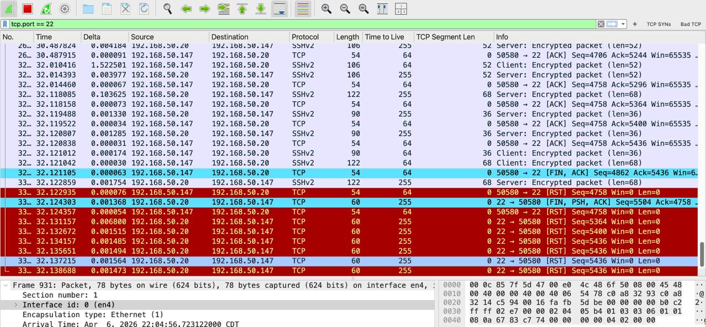
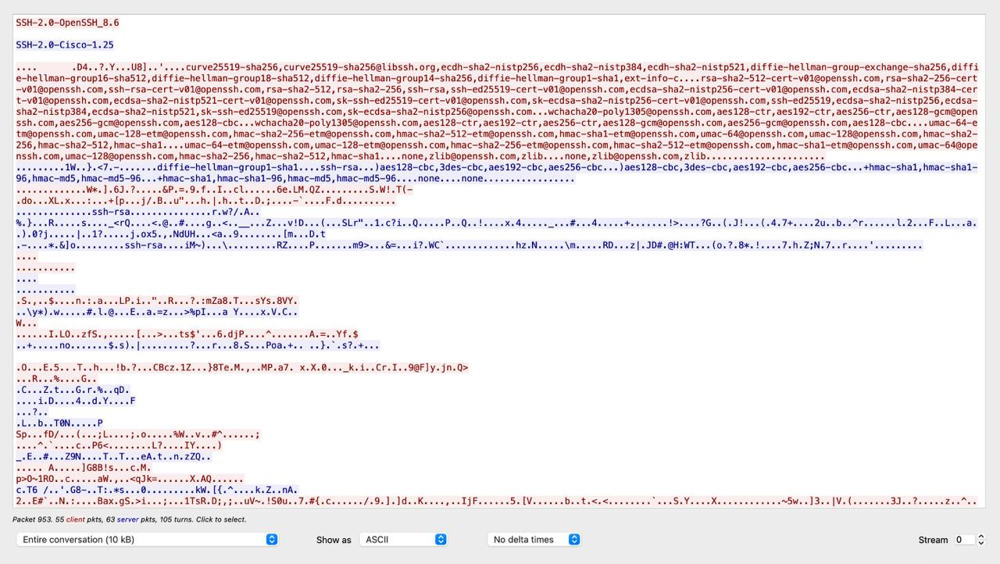

# SSH — Encrypted Remote Access
**Lab: 04 — SSH Configuration and Encrypted Stream Analysis**
**Equipment:** MacBook Pro 2015 (macOS Monterey 12.7.6) · Cisco 1700 Router (NetOps-1700) · Linksys E2500 Buffer Router · Insignia USB-A to Gigabit Ethernet Adapter
**Tool:** Wireshark 4.6.4 · OpenSSH 8.6
**Capture Interface:** en4 (USB 10/100/1000 LAN)
**Capture File:** lab04-ssh-encrypted-stream.pcapng (stored locally)
**CCNA Domain:** 1.0 Network Fundamentals · 5.0 Security Fundamentals — Encrypted remote access, SSH vs Telnet

---

## Overview

Lab 03 proved that Telnet sends everything in cleartext — passwords, commands, and router output all visible in a Wireshark TCP stream with zero effort.

Lab 04 is the fix.

This lab configures SSH version 2 on a Cisco 1700 router running IOS 12.4(25d) `advsecurityk9` — a crypto-capable image — and captures the session in Wireshark. The TCP stream follow produces encrypted gibberish instead of readable credentials. That contrast is the entire security argument for SSH over Telnet, demonstrated on live hardware.

---

## Lab Environment

| Component | Device | IP Address |
|---|---|---|
| Capture Station | MacBook Pro 2015 — macOS Monterey 12.7.6 | 192.168.50.147 |
| Capture Interface | Insignia USB-A Gigabit Ethernet (en4) | 192.168.50.147 |
| Buffer Router | Linksys E2500 (NetOpsZero) | 192.168.50.1 |
| SSH Lab Device | Cisco 1700 (NetOps-1700) — IOS 12.4(25d) advsecurityk9 | 192.168.50.20 |

### Network Path

```
MacBook (en4) → Linksys E2500 (192.168.50.1) → Cisco 1700 (192.168.50.20)
```

### Why the Cisco 1700

The Cisco 2621 (NetOps-R1) used in Labs 01–03 runs IOS 12.1(3)T — a base image with no crypto feature set. SSH is not possible on that device without an IOS upgrade. The Cisco 1700 runs `c1700-advsecurityk9-mz.124-25d.bin` — full crypto support, SSH ready out of the box.

---

## Device Info — Cisco 1700

| Setting | Value |
|---|---|
| Hostname | NetOps-1700 |
| IOS Image | `c1700-advsecurityk9-mz.124-25d.bin` |
| IOS Version | 12.4(25d) |
| Crypto Support | Full — advsecurityk9 |
| Interface | FastEthernet0 |
| IP Address | 192.168.50.20 / 255.255.255.0 |
| SSH Version | 2.0 |

---

## Interface Configuration

The 1700 shipped with FastEthernet0 unassigned and administratively down. A Cat5e patch cable was connected from FastEthernet0 to a Linksys LAN port, then the interface was brought up:

```
conf t
hostname NetOps-1700
interface fastethernet0
 ip address 192.168.50.20 255.255.255.0
 no shutdown
exit
```

Verification:

```
Netops-1700#show ip interface brief

Interface        IP-Address      OK? Method Status   Protocol
FastEthernet0    192.168.50.20   YES manual up        up
```

Connectivity confirmed from MacBook:

```bash
ping -c 3 192.168.50.20
# 0% packet loss
```

---

## SSH Configuration

### Step 1 — Set domain name

Required for RSA key generation — the key is named using `hostname.domain-name`:

```
ip domain-name ccnahome.lab
```

### Step 2 — Create local user

```
username admin privilege 15 secret cisco123
```

`privilege 15` grants direct privileged exec access on login — no `enable` required.

### Step 3 — Generate RSA keys

```
crypto key generate rsa
```

When prompted for key size:
```
How many bits in the modulus [512]: 1024
```

Output:
```
% Generating 1024 bit RSA keys, keys will be non-exportable...[OK]
*Mar  9 21:55:46.459: %SSH-5-ENABLED: SSH 1.99 has been enabled
```

### Step 4 — Force SSH version 2

```
ip ssh version 2
```

### Step 5 — Configure VTY lines

```
line vty 0 4
 transport input ssh
 login local
exit
```

`transport input ssh` — replaces `transport input telnet` from Lab 03. Telnet is now explicitly blocked on this device.

### Step 6 — Save

```
write memory
```

### Verification

```
Netops-1700#show ip ssh
SSH Enabled - version 2.0
Authentication timeout: 120 secs; Authentication retries: 3

Netops-1700#show ssh
%No SSHv2 server connections running.
%No SSHv1 server connections running.
```

SSH 2.0 enabled. No active sessions — ready for capture.

---

## macOS SSH Compatibility

macOS Sonoma/Monterey's OpenSSH client (8.6) dropped support for older key exchange algorithms by default. The Cisco 1700 running IOS 12.4 only offers `diffie-hellman-group1-sha1` and legacy ciphers — a compatibility mismatch that produces errors without explicit flags.

**Error 1 — Key exchange mismatch:**
```
Unable to negotiate with 192.168.50.20 port 22: no matching key exchange method found.
Their offer: diffie-hellman-group1-sha1
```

**Error 2 — Cipher mismatch:**
```
Unable to negotiate with 192.168.50.20 port 22: no matching cipher found.
Their offer: aes128-cbc,3des-cbc,aes192-cbc,aes256-cbc
```

**Fix — specify legacy algorithms explicitly (one-time or scripted use):**
```bash
ssh -oKexAlgorithms=+diffie-hellman-group1-sha1 -oCiphers=+aes128-cbc admin@192.168.50.20
```

> This is a client-side compatibility flag — the encryption is still active. The session is encrypted with AES-128-CBC. The flag tells the Mac's SSH client to accept the older negotiation method, not to disable encryption.

### Permanent Fix — `~/.ssh/config`

The inline flags work but require retyping on every connection. The correct solution is a persistent `~/.ssh/config` entry that applies the legacy algorithm flags automatically for this host.

**Create the config file:**

```bash
mkdir -p ~/.ssh && cat >> ~/.ssh/config << 'EOF'
Host 192.168.50.20
  HostName 192.168.50.20
  User admin
  KexAlgorithms +diffie-hellman-group1-sha1
  HostKeyAlgorithms +ssh-rsa
  Ciphers +aes128-cbc
EOF
chmod 600 ~/.ssh/config
```

**Verify:**

```bash
cat ~/.ssh/config
```

Expected output:
```
Host 192.168.50.20
  HostName 192.168.50.20
  User admin
  KexAlgorithms +diffie-hellman-group1-sha1
  HostKeyAlgorithms +ssh-rsa
  Ciphers +aes128-cbc
```

**Connect — no flags required from this point forward:**

```bash
ssh 192.168.50.20
```

> `chmod 600` is required — OpenSSH refuses to read a config file with open permissions. This is enforced at the client level and is not configurable.

**From Lab 05 onward, `ssh 192.168.50.20` is the only command needed to access NetOps-1700. The console cable is reserved for ROMMON recovery and Layer 1 failures only.**

---

## Wireshark Capture

- Interface: `en4`
- Display filter: `tcp.port == 22`
- Capture started before initiating SSH session

SSH session initiated:

```bash
ssh 192.168.50.20
```

> `~/.ssh/config` handles legacy algorithm negotiation automatically — see macOS SSH Compatibility section.

Commands run during session:

```
show version
show ip interface brief
exit
```

---

## Wireshark Analysis

### Packet Capture View



The packet list shows SSHv2 protocol packets between `192.168.50.147` (MacBook) and `192.168.50.20` (NetOps-1700). Every data packet in the Info column reads **"Encrypted packet (len=XX)"** — no readable content, no protocol fields beyond the TCP/IP headers.

Compare to Lab 03 where the same column showed `1 byte data` for each Telnet keystroke — individually readable character by character.

### TCP Stream — Encrypted



Right-click any SSHv2 packet → **Follow → TCP Stream**

The stream shows:

- `SSH-2.0-OpenSSH_8.6` — MacBook SSH client version banner
- `SSH-2.0-Cisco-1.25` — Cisco 1700 SSH server version banner
- Everything after: unreadable encrypted ciphertext

The only plaintext visible is the version banner exchange during the initial SSH handshake — this is normal and expected behavior. No credentials. No commands. No router output. Nothing an attacker can use.

**Total conversation: 10KB. 55 client packets. 63 server packets. 105 turns.**

---

## Lab 03 vs Lab 04 — Direct Comparison

| Item | Lab 03 — Telnet | Lab 04 — SSH |
|---|---|---|
| Protocol | TELNET | SSHv2 |
| Port | 23 | 22 |
| Credentials in stream | `cisco`, `cisco123` — plaintext | Not visible — encrypted |
| Commands in stream | `show version`, `show ip interface brief` — plaintext | Not visible — encrypted |
| Router output in stream | Full IOS version, interface table — plaintext | Not visible — encrypted |
| TCP Stream result | Full readable session transcript | Encrypted gibberish |
| Attack complexity | Zero — right-click, Follow TCP Stream | Requires breaking AES-128-CBC encryption |
| IOS requirement | Any IOS image | Crypto-capable image (`k9`) required |

---

## Key Findings

| Finding | Detail |
|---|---|
| SSH encrypts the entire session | Version banners are the only plaintext — everything else is ciphertext |
| AES-128-CBC is the negotiated cipher | Visible in the SSH handshake packets — strong symmetric encryption |
| `transport input ssh` blocks Telnet | VTY lines on this device reject Telnet connections entirely |
| Legacy algorithm flags required on macOS | Modern OpenSSH dropped diffie-hellman-group1-sha1 by default — explicit flag or `~/.ssh/config` entry needed for IOS 12.4 compatibility |
| `~/.ssh/config` is the permanent solution | One-time setup eliminates inline flags on every connection — `ssh 192.168.50.20` is sufficient from Lab 05 onward |
| Privilege 15 eliminates enable prompt | Direct privileged exec on login — no second password required |

---

## Real-World Relevance

**Why SSH replaced Telnet:** Any device on the same Layer 2 segment — or with access to a SPAN/mirror port — can capture and read a complete Telnet session. SSH eliminates this attack surface by encrypting everything after the TCP handshake.

**`transport input ssh` vs `transport input telnet`:** This single IOS command is the difference between a device that is remotely manageable securely and one that exposes credentials to any packet sniffer on the segment. In production, `transport input telnet` should never appear on a VTY line.

**Legacy hardware reality:** Devices running base IOS images without the `k9` feature set cannot run SSH. This is why Telnet still exists in production environments — old hardware that was never upgraded. Lab 03 demonstrated the risk. Lab 04 demonstrates the mitigation.

**CCNA exam relevance:** SSH vs Telnet configuration and the security rationale behind the choice is directly tested under Security Fundamentals (Domain 5.0). Understanding `crypto key generate rsa`, `ip ssh version 2`, and `transport input ssh` is expected knowledge.

---

## Key Takeaways

| Concept | What the Lab Proved |
|---|---|
| SSH encrypts all session data | Credentials, commands, and output — none visible in packet capture |
| Telnet vs SSH contrast is definitive | Lab 03 TCP stream readable, Lab 04 TCP stream unreadable — same hardware, different protocol |
| `advsecurityk9` IOS required | Base IOS images cannot generate RSA keys or run SSH |
| Legacy algorithm compatibility | Modern SSH clients require `~/.ssh/config` entry or explicit flags to connect to IOS 12.4 devices |
| `~/.ssh/config` is the CI/CD-correct solution | Permanent host config — no inline flags, no retyping, reproducible across sessions |
| `transport input ssh` is the mitigation | One command replaces Telnet with SSH on VTY lines |

---

## What's Next — Lab 05

Lab 05 brings the Catalyst 3500XL switch online — VLAN configuration, trunk links between the switch and router, and Wireshark captures showing VLAN-tagged traffic (802.1Q). The switch has been staged in the lab since the beginning. Lab 05 is where it goes active.

---

## Commands Reference

```bash
# macOS — SSH (permanent, no flags required after ~/.ssh/config setup)
ssh 192.168.50.20

# macOS — SSH with inline legacy flags (before ~/.ssh/config, or one-off use)
ssh -oKexAlgorithms=+diffie-hellman-group1-sha1 -oCiphers=+aes128-cbc admin@192.168.50.20

# Create ~/.ssh/config entry for permanent legacy algorithm support
mkdir -p ~/.ssh && cat >> ~/.ssh/config << 'EOF'
Host 192.168.50.20
  HostName 192.168.50.20
  User admin
  KexAlgorithms +diffie-hellman-group1-sha1
  HostKeyAlgorithms +ssh-rsa
  Ciphers +aes128-cbc
EOF
chmod 600 ~/.ssh/config

# Verify IP before connecting
ping -c 3 192.168.50.20

# Wireshark display filter
tcp.port == 22
```

```
# Cisco 1700 — SSH configuration
ip domain-name ccnahome.lab
username admin privilege 15 secret <password>
crypto key generate rsa
ip ssh version 2
line vty 0 4
 transport input ssh
 login local
exit
write memory

# Verification
show ip ssh
show ssh
show ip interface brief
```

---

*Lavoisier Cornerstone — [lavoisier.dev](https://lavoisier.dev) | [github.com/cornerstonian](https://github.com/cornerstonian)*
*Part of the [wireshark-traffic-analysis-ccna](https://github.com/cornerstonian/wireshark-traffic-analysis-ccna) project series*
