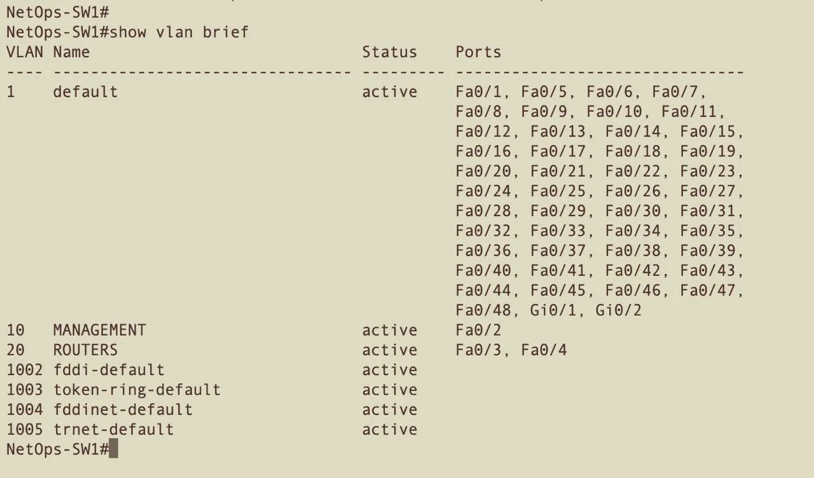
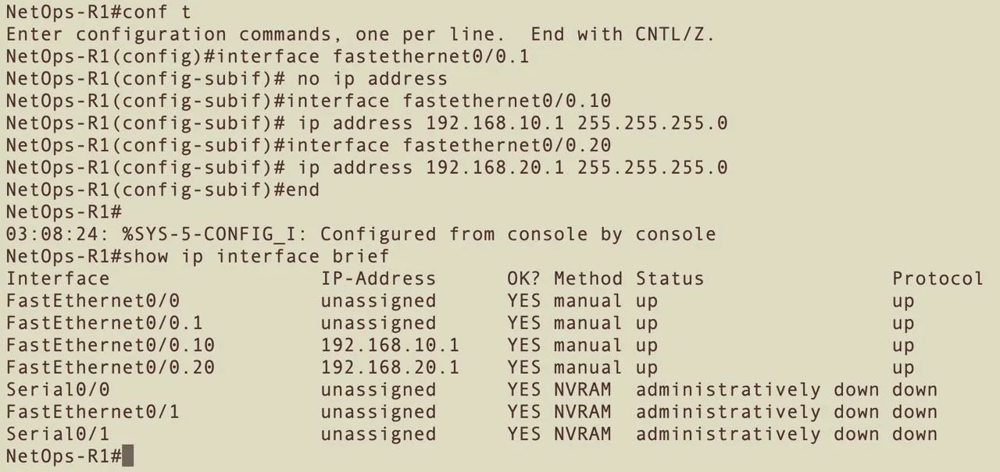
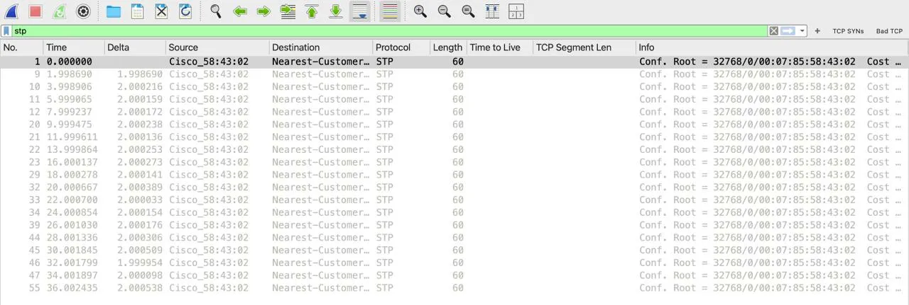

# Switch Integration & VLANs
**Lab: 05 — Catalyst 3500XL Integration, VLAN Segmentation, and Inter-VLAN Routing**
**Equipment:** MacBook Pro 2015 (macOS Monterey 12.7.6) · Cisco Catalyst 3500XL (NetOps-SW1) · Cisco 2621 Router (NetOps-R1) · Cisco 1700 Router (NetOps-1700) · Linksys E2500 Buffer Router · Insignia USB-A to Gigabit Ethernet Adapter
**Tool:** Wireshark 4.6.4
**Capture Interface:** en4 (USB 10/100/1000 LAN)
**Capture Files:** lab05-vlan-isolation.pcapng · lab05-intervlan-routing.pcapng · lab05-stp-bpdus.pcapng (stored locally)
**CCNA Domain:** 1.0 Network Fundamentals · 2.0 Network Access — VLANs, trunking, STP, inter-VLAN routing

---

## Overview

Labs 01–04 operated on a flat network — every device plugged directly into the Linksys E2500, all on the same Layer 2 segment with no switching infrastructure. Lab 05 changes the architecture entirely.

The Catalyst 3500XL goes active as the core lab switch. Every device migrates from the E2500 LAN ports onto the switch. VLANs segment the network into isolated broadcast domains. The Cisco 2621 becomes a router-on-a-stick, routing traffic between VLANs across a single ISL trunk link. Wireshark captures prove isolation, inter-VLAN routing, and STP operation — all on physical hardware.

---

## Lab Environment

### Physical Topology

```
Internet
   |
Xfinity Gateway
   |
Linksys E2500 (192.168.50.1) — NAT + DHCP + buffer
   |
   Fa0/1 — NetOps-SW1 (Catalyst 3500XL) — 192.168.50.30
              |
              |-- Fa0/2  [VLAN 10] — MacBook Pro (en4) — 192.168.10.50
              |-- Fa0/3  [TRUNK]   — Cisco 2621 (NetOps-R1) — Fa0/0
              |-- Fa0/4  [VLAN 20] — Cisco 1700 (NetOps-1700) — 192.168.20.20
```

### Device Table

| Device | Role | Interface | IP | VLAN |
|---|---|---|---|---|
| MacBook Pro 2015 | Capture station | en4 (Insignia USB-A) | 192.168.10.50 | 10 |
| Linksys E2500 | Buffer router — NAT/DHCP | LAN port | 192.168.50.1 | 1 |
| Catalyst 3500XL (NetOps-SW1) | Core lab switch | VLAN1 SVI | 192.168.50.30 | 1 |
| Cisco 2621 (NetOps-R1) | Inter-VLAN router | Fa0/0.10 | 192.168.10.1 | 10 |
| Cisco 2621 (NetOps-R1) | Inter-VLAN router | Fa0/0.20 | 192.168.20.1 | 20 |
| Cisco 1700 (NetOps-1700) | Lab device | Fa0 | 192.168.20.20 | 20 |

### VLAN Design

| VLAN | Name | Subnet | Purpose |
|---|---|---|---|
| 1 | default | 192.168.50.0/24 | Switch management + E2500 uplink |
| 10 | MANAGEMENT | 192.168.10.0/24 | MacBook capture station |
| 20 | ROUTERS | 192.168.20.0/24 | Cisco 2621 + Cisco 1700 |

---

## Switch Hardware

**Model:** Cisco WS-C3548-XL
**IOS:** 12.0(5)WC3b — C3500XL Software (C3500XL-C3H2S-M)
**Ports:** 48 x FastEthernet + 2 x GigabitEthernet uplinks
**Trunking:** ISL (default) — 802.1Q not supported on this IOS version
**STP:** Classic 802.1D — `rapid-pvst` not available on this platform

> **IOS Note:** The 3500XL runs an older switch IOS with two key behavioral differences from modern Catalyst switches: (1) VLANs are created via `vlan database` mode, not global config mode. (2) Trunking defaults to ISL encapsulation, not 802.1Q. All configurations in this lab account for these differences.

---

## Phase 1 — Switch Baseline Configuration

### Initial State

On first power-on, the 3500XL presented a clean config — hostname `C3500XL`, no passwords, no VLANs beyond the defaults, all 48 ports in VLAN 1. Confirmed via `show running-config` and `show vlan`.

### Baseline Config Applied

```
enable
conf t
hostname NetOps-SW1
enable secret cisco123
interface vlan 1
 ip address 192.168.50.30 255.255.255.0
 no shutdown
exit
ip default-gateway 192.168.50.1
end
write memory
```

### Verification

```
NetOps-SW1#ping 192.168.50.1
!!!!!

NetOps-SW1#show ip interface brief
Interface    IP-Address     OK? Method Status   Protocol
VLAN1        192.168.50.30  YES manual up        up
```

MacBook confirmed reachability:
```bash
ping -c 5 192.168.50.30   # 0% packet loss
ping -c 5 192.168.50.10   # 0% packet loss — 2621 reachable through switch
```

---

## Phase 2 — VLAN Creation

> The 3500XL requires VLAN creation via `vlan database` mode. The `vlan <id>` command in global config mode produces `% Invalid input detected` on IOS 12.0(5)WC3b.

```
vlan database
vlan 10 name MANAGEMENT
vlan 20 name ROUTERS
apply
exit
```

### Verification

```
NetOps-SW1#show vlan brief
VLAN Name          Status    Ports
1    default        active    Fa0/1–Fa0/48, Gi0/1, Gi0/2
10   MANAGEMENT     active
20   ROUTERS        active
```

VLANs 10 and 20 created with no ports assigned — expected at this stage.

### Final VLAN State



---

## Phase 3 — Access Port Assignment

```
conf t
interface fastethernet0/2
 switchport access vlan 10
interface fastethernet0/3
 switchport access vlan 20
interface fastethernet0/4
 switchport access vlan 20
end
```

> **XL Architecture Note:** On the 3500XL, VLAN port assignments are stored in `flash:vlan.dat`, not in the IOS running-config. `show running-config` will show empty interface stanzas even when assignments are active. `show vlan brief` is the authoritative verification command for port assignments on this platform.

### Verification

```
NetOps-SW1#show vlan brief
VLAN Name          Status    Ports
1    default        active    Fa0/1, Fa0/5–Fa0/48, Gi0/1, Gi0/2
10   MANAGEMENT     active    Fa0/2
20   ROUTERS        active    Fa0/3, Fa0/4
```

### macOS Network Priority Fix

Moving the MacBook (Fa0/2) to VLAN 10 isolated it from the E2500 (VLAN 1), which disrupted internet connectivity because macOS was routing internet traffic through en4 instead of Wi-Fi. Root cause: USB Ethernet adapters were listed above Wi-Fi in the macOS network service order.

**Fix — set Wi-Fi as primary interface via Terminal:**

```bash
sudo networksetup -ordernetworkservices "Wi-Fi" "USB 10/100/1G/2.5G LAN" "USB 10/100/1000 LAN" "Thunderbolt Bridge"
```

**Verify:**

```bash
networksetup -listnetworkserviceorder
# (1) Wi-Fi must appear first
```

After this fix, both interfaces operate simultaneously:
- `en0` — `10.0.0.180` — Wi-Fi, internet
- `en4` — `192.168.10.50` — lab network, switch

---

## Phase 4 — VLAN Isolation Capture

**Capture file:** `lab05-vlan-isolation.pcapng`
**Interface:** en4
**Filter:** `arp`

With the MacBook in VLAN 10 and the 2621 in VLAN 20, ping to `192.168.50.10` produced 100% packet loss. Wireshark showed the isolation mechanism at Layer 2:

```bash
ping -c 3 192.168.50.10   # 100% packet loss
```

**Capture analysis:**

| Observation | Detail |
|---|---|
| ARP requests | Continuous broadcasts — "Who has 192.168.50.1? Tell 192.168.50.143" |
| ARP replies | Zero — the E2500 is in VLAN 1, MacBook is in VLAN 10 |
| STP BPDUs | Visible from `Cisco_58:43:02` every 2 seconds |
| DHCP Discover | MacBook broadcasting for a gateway — no response |
| CDP | NetOps-SW1 advertising itself on FastEthernet0 |

The ARP broadcast from the MacBook never crosses the VLAN boundary. The E2500 at `192.168.50.1` is unreachable at Layer 2 from VLAN 10. This is VLAN isolation working as designed.

> The MacBook ARPs for `192.168.50.1` (the gateway) rather than `192.168.50.10` (the 2621) because macOS attempts to resolve its default gateway before sending to any destination on the subnet. With no gateway reachable in VLAN 10, all traffic is blocked at Layer 2.

---

## Phase 5 — Trunk Link & Router-on-a-Stick

### Trunk Configuration on 3500XL

```
conf t
interface fastethernet0/3
 switchport mode trunk
end
```

**Verification:**

```
NetOps-SW1#show interfaces fastethernet0/3 switchport
Administrative mode: trunk
Operational Mode: trunk
Administrative Trunking Encapsulation: isl
Operational Trunking Encapsulation: isl
Trunking VLANs Active: 1,10,20
```

> Fa0/3 carries all three active VLANs (1, 10, 20) tagged with ISL. The 2621 must use `encapsulation isl` on its subinterfaces — not `encapsulation dot1q` — to match.

### Router-on-a-Stick Configuration on Cisco 2621

```
conf t
interface fastethernet0/0
 no ip address
interface fastethernet0/0.1
 encapsulation isl 1
interface fastethernet0/0.10
 encapsulation isl 10
 ip address 192.168.10.1 255.255.255.0
interface fastethernet0/0.20
 encapsulation isl 20
 ip address 192.168.20.1 255.255.255.0
end
write memory
```

**Subinterface explanation:**

| Subinterface | Encapsulation | IP | Role |
|---|---|---|---|
| Fa0/0 | none | unassigned | Physical trunk port — no IP |
| Fa0/0.1 | ISL VLAN 1 | unassigned | VLAN 1 — E2500 owns .1 |
| Fa0/0.10 | ISL VLAN 10 | 192.168.10.1 | Default gateway for MacBook |
| Fa0/0.20 | ISL VLAN 20 | 192.168.20.1 | Default gateway for 1700 |

**Verification:**

```
NetOps-R1#show ip interface brief
FastEthernet0/0       unassigned    up  up
FastEthernet0/0.1     unassigned    up  up
FastEthernet0/0.10    192.168.10.1  up  up
FastEthernet0/0.20    192.168.20.1  up  up

NetOps-R1#show ip route
C    192.168.10.0/24 is directly connected, FastEthernet0/0.10
C    192.168.20.0/24 is directly connected, FastEthernet0/0.20
```



### Cisco 1700 IP Update

The 1700 retained its Lab 04 IP of `192.168.50.20` — incorrect for VLAN 20 (`192.168.20.0/24`). Updated via console:

```
conf t
interface fastethernet0
 ip address 192.168.20.20 255.255.255.0
 no shutdown
exit
ip route 0.0.0.0 0.0.0.0 192.168.20.1
end
write memory
```

**Why the static default route was required:** The 1700 receives pings routed from VLAN 10 through the 2621. Without a return route, the 1700 had no path back to `192.168.10.0/24` — reply packets were dropped. The default route via `192.168.20.1` sends all unknown traffic to the 2621, which knows the path to VLAN 10.

```
Netops-1700#show ip route
Gateway of last resort is 192.168.20.1 to network 0.0.0.0
C    192.168.20.0/24 is directly connected, FastEthernet0
S*   0.0.0.0/0 [1/0] via 192.168.20.1
```

### MacBook Static IP & Route

```bash
sudo ifconfig en4 192.168.10.50 255.255.255.0
sudo route add -net 192.168.20.0/24 192.168.10.1
```

---

## Phase 6 — Inter-VLAN Routing Capture

**Capture file:** `lab05-intervlan-routing.pcapng`
**Interface:** en4
**Filter:** `icmp`

```bash
ping -c 3 192.168.20.20   # 0% packet loss
```

**Result:**
```
64 bytes from 192.168.20.20: icmp_seq=0 ttl=254 time=2.786 ms
64 bytes from 192.168.20.20: icmp_seq=1 ttl=254 time=2.011 ms
64 bytes from 192.168.20.20: icmp_seq=2 ttl=254 time=2.047 ms
```

**TTL=254 is the routing proof.** The 2621 decremented TTL by 1 when it routed the packet between VLANs. TTL=255 would indicate direct Layer 2 delivery. TTL=254 confirms a routed hop occurred.

**Full packet path:**

```
MacBook (192.168.10.50, VLAN 10)
   ↓ en4 → NetOps-SW1 Fa0/2
NetOps-SW1 trunks to Fa0/3 (ISL tagged VLAN 10)
   ↓ → NetOps-R1 Fa0/0.10
NetOps-R1 routes VLAN 10 → VLAN 20
   ↓ Fa0/0.20 → NetOps-SW1 Fa0/3 (ISL tagged VLAN 20)
NetOps-SW1 switches to Fa0/4
   ↓ → NetOps-1700 Fa0 (192.168.20.20)
Reply follows reverse path — TTL decremented by 1 at NetOps-R1
```

---

## Phase 7 — STP Capture

**Capture file:** `lab05-stp-bpdus.pcapng`
**Interface:** en4
**Filter:** `stp`

No traffic generated — passive capture only.



**Capture analysis:**

| Field | Value | Meaning |
|---|---|---|
| Source | `Cisco_58:43:02` | NetOps-SW1 — the 3500XL |
| Destination | `01:80:c2:00:00:00` | STP multicast — all bridges |
| Delta | 2.000 seconds | Hello timer — default, unchanged |
| Root Bridge ID | `32768/0/00:07:85:58:43:02` | NetOps-SW1 is root bridge |
| Bridge Priority | 32768 | Default — no manual configuration |

**Root bridge election:** With only one switch in the topology, the 3500XL wins the root bridge election by default. In a multi-switch topology, the switch with the lowest Bridge ID (priority + MAC) wins. BPDUs would show competing bridge advertisements during the election process.

**CCNA exam relevance:** Hello timer (2 sec), max age (20 sec), forward delay (15 sec), root bridge election, and BPDU format are directly tested under Network Access (Domain 2.0).

---

## Key Findings

| Finding | Detail |
|---|---|
| VLAN isolation is Layer 2 | ARP broadcasts do not cross VLAN boundaries — proven by zero ARP replies in capture |
| ISL trunking on 3500XL | This platform defaults to ISL, not 802.1Q — subinterfaces must use `encapsulation isl` |
| Router-on-a-stick routes between VLANs | One physical cable carries all VLANs — TTL decrement proves routing occurred |
| Return route is required | The 1700 needed a default route to send replies back through the 2621 — asymmetric routing causes silent failure |
| VLAN assignments not in running-config | On XL-era IOS, port VLAN assignments live in `flash:vlan.dat` — use `show vlan brief` to verify |
| macOS service order matters | USB Ethernet above Wi-Fi causes internet disruption when Ethernet connects to an isolated VLAN |
| STP runs automatically | No configuration required — BPDUs appear immediately on switch boot |
| TTL=254 proves routing | Direct Layer 2 delivery = TTL 255. One routed hop = TTL 254 |

---

## Troubleshooting Log

| Issue | Cause | Resolution |
|---|---|---|
| Internet drops when MacBook plugged into switch | macOS routing internet traffic through en4 — USB Ethernet above Wi-Fi in service order | `sudo networksetup -ordernetworkservices` — moved Wi-Fi to position 1 |
| `vlan <id>` rejected in global config | 3500XL IOS 12.0 requires `vlan database` mode for VLAN creation | Used `vlan database` → `vlan 10 name MANAGEMENT` → `apply` |
| Subinterface IPs not assigning | All subinterfaces in same `/24` subnet as existing network — conflict | Moved VLAN 10 to `192.168.10.0/24` and VLAN 20 to `192.168.20.0/24` |
| ping to 1700 failing from MacBook | 1700 had no return route to `192.168.10.0/24` | Added `ip route 0.0.0.0 0.0.0.0 192.168.20.1` on 1700 |
| SSH to 1700 timing out | 1700 still had `192.168.50.20` — wrong subnet for VLAN 20 | Updated to `192.168.20.20` via console |
| VLAN port assignments not persisting | XL-era IOS stores assignments in `vlan.dat` not running-config | Verified with `show vlan brief` — assignments confirmed active |

---

## Commands Reference

```
# Catalyst 3500XL — VLAN creation (vlan database mode required)
vlan database
vlan 10 name MANAGEMENT
vlan 20 name ROUTERS
apply
exit

# Catalyst 3500XL — port assignment
conf t
interface fastethernet0/2
 switchport access vlan 10
interface fastethernet0/3
 switchport mode trunk
interface fastethernet0/4
 switchport access vlan 20
end

# Catalyst 3500XL — verification
show vlan brief
show interfaces fastethernet0/3 switchport
show mac-address-table

# Cisco 2621 — router-on-a-stick (ISL encapsulation)
conf t
interface fastethernet0/0
 no ip address
interface fastethernet0/0.10
 encapsulation isl 10
 ip address 192.168.10.1 255.255.255.0
interface fastethernet0/0.20
 encapsulation isl 20
 ip address 192.168.20.1 255.255.255.0
end
write memory

# Cisco 1700 — IP update and default route
conf t
interface fastethernet0
 ip address 192.168.20.20 255.255.255.0
 no shutdown
exit
ip route 0.0.0.0 0.0.0.0 192.168.20.1
end
write memory

# macOS — static IP and route for VLAN 10
sudo ifconfig en4 192.168.10.50 255.255.255.0
sudo route add -net 192.168.20.0/24 192.168.10.1

# macOS — fix network service order (run once, permanent)
sudo networksetup -ordernetworkservices "Wi-Fi" "USB 10/100/1G/2.5G LAN" "USB 10/100/1000 LAN" "Thunderbolt Bridge"

# Wireshark display filters
stp                  # STP BPDUs
arp                  # ARP — isolation proof
icmp                 # Inter-VLAN routing proof
vlan                 # 802.1Q tagged frames (ISL not decoded same way)
```

---

## What's Next — Lab 06

Lab 06 implements Access Control Lists on the Cisco 2621 — filtering traffic between VLANs, capturing RST packets and ICMP Admin Prohibited (type 3 code 13) as ACL deny proof, and verifying ACL behavior with Wireshark. The VLAN infrastructure built in Lab 05 is the foundation Lab 06 builds on.

---

*Lavoisier Cornerstone — [lavoisier.dev](https://lavoisier.dev) | [github.com/cornerstonian](https://github.com/cornerstonian)*
*Part of the [wireshark-traffic-analysis-ccna](https://github.com/cornerstonian/wireshark-traffic-analysis-ccna) project series*
